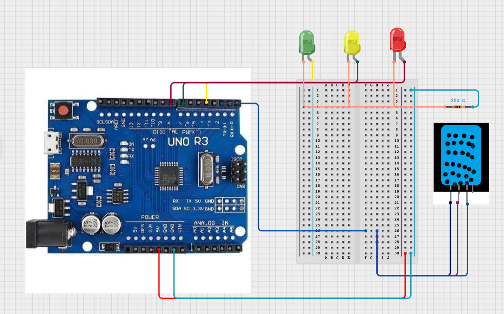

# The "weather"

Using DHT11 sensor to read temperature and humidity

## Usage

The green LED is on when conditions are perfect, yellow when they are not great but livable, red when something is wrong.

## Diagram

Note that your DHT11 sensor might have different pinout (and mine has internal resistor, but some versions require you put your own).

